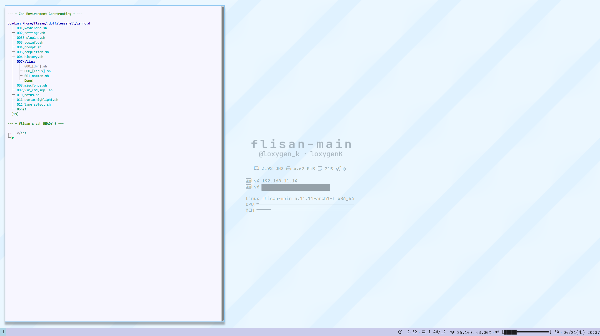

<h1 align="center">Dotfiles</h1>

Dotfiles. Files in this repository are used in computers I usually use.

## :jigsaw: Components

- :shell: **zsh** ― `shell/`

- :framed_picture: **i3wm** (i3-gaps) ― `wm/i3` 
  A tile window manager.
  
  - :computer: **conky** ― `wm/conkyrc` 
  Shows information about the machine on the desktop screen.
  
  - :speech_balloon: :**i3blocks** ― `wm/i3blocks/` A status bar shown at the bottom of the screens.
  
  - :mailbox_with_mail: **dunst** ― `wm/dunst/` 
    
An notification server customizable with Pango.
    
  - :sparkles: **picom** ― `wm/picom.conf` A composite manager. Supports shades behind the window, opacity, and so on.
  
- :man_technologist: **Neovim** ― `vim/` 
  
  - :smiling_imp: **dein.vim** ― `vim/plugins/`,

## :building_construction: Structure of the repository

- :world_map: `/path/to/loxygenK/dotfiles`
  - :bento: `assets/` Pictures used in this README.

  - :shell: `shell/` Dotfiles used by Zsh.

    - :triangular_flag_on_post: `zshrc` `.zshrc` .  Shell scripts in`zshrc.d` do actual configuration.

    - :books: `zshrc.d/` Shell scripts that do specific settings.

  - :memo: `vim/` Dotfiles used by Neovim.

    - :mage: `coc-settings.json` Configuration for coc.nvim.
- :triangular_flag_on_post: `init.vim` Configuration script file for Neovim. Scripts in  `./init.vim.d` do actual configuration.
    - :books: `init.vim.d/` Scripts that do specific settings for Neovim.
- :package: `plugins/` Lists of the plugins I use in Neovim.
    - :jigsaw: `snippets/` Snippets.
- :framed_picture: `wm/` Files that do configuration for window manager.
    - :computer: `conkyrc`
  - :mailbox_with_mail: `dunst/`
        - :framed_picture: `i3/`
  - :speech_balloon: `i3blocks`
        - :sparkles: `picom.conf`

# :eyes: Appearance

# :page_with_curl: Licenses

MIT. Refer [LICENSE](https://github.com/loxygenK/dotfiles/blob/master/LICENSE) for the detail.

## :bow: Acknowledgements

### :abc: The font used in the header and the screen shot

The font used in the header and the screen shot are the font distributed under the MIT license.

Copyright (c) 2014 Ryan L McIntyre
Released under the MIT license
https://github.com/ryanoasis/nerd-fonts/blob/master/LICENSE

### :sparkles: Icons in Conky

The icons used in Conky are from the font distributed under the MIT license.

Copyright (c) 2013 Gabriele Lana
Released under the MIT license
https://github.com/gabrielelana/awesome-terminal-fonts/blob/master/LICENSE

