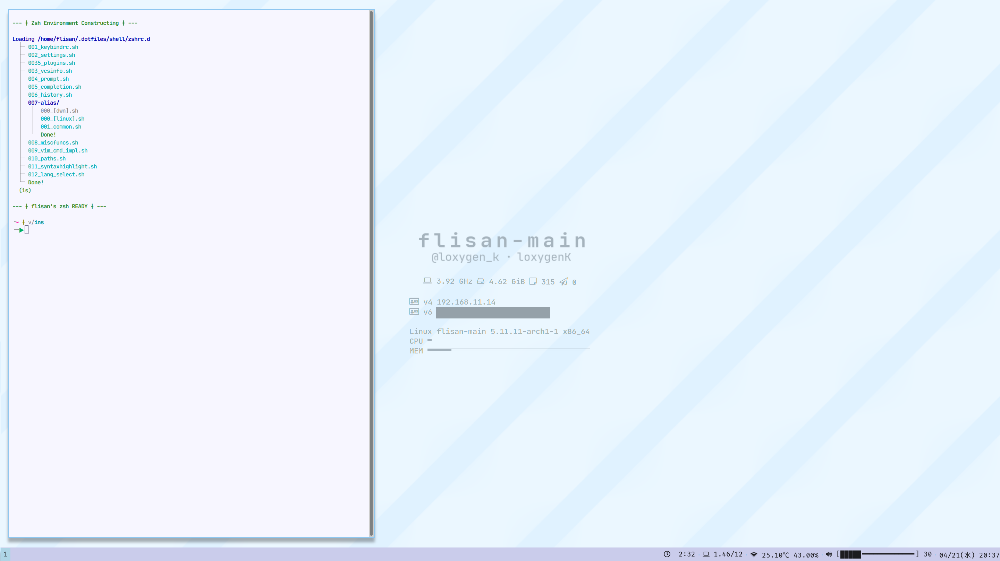

<h1 align="center">Dotfiles</h1>

Dotfiles です。ぼくの使用している端末にはこれが入っています。

## :jigsaw: Components

- :shell: **zsh** ― `shell/`

- :framed_picture: **i3wm** (i3-gaps) ― `wm/i3` 
  タイル型ウィンドウマネージャです。
  - :computer: **conky** ― `wm/conkyrc` 
    デスクトップ上にマシンの様々な状態を表示するソフトウェアです。

  - :speech_balloon: :**i3blocks** ― `wm/i3blocks/` 
    i3wm の下部に表示されるステータスバーです。

  - :mailbox_with_mail: **dunst** ― `wm/dunst/` 
    Pango でカスタマイズできる通知サーバーです。

  - :sparkles: **picom** ― `wm/picom.conf` 
    コンポジットマネージャです。 
    ウィンドウの影や透明度設定などをサポートします。

- :man_technologist: **Neovim** ― `vim/` 
  - :smiling_imp: **dein.vim** ― `vim/plugins/`,

## :building_construction: Structure of the repository

- :world_map: `/path/to/loxygenK/dotfiles`
  - :bento: `assets/` README に使用している画像が入っている場所です。

  - :shell: `shell/` Zsh で使用している Dotfiles が入っている場所です。

    - :triangular_flag_on_post: `zshrc` `.zshrc` です。実際の設定処理は `./zshrc.d` 内のスクリプトが行います。

    - :books: `zshrc.d/` 具体的な設定を行うシェルスクリプトが入っているディレクトリです。

  - :memo: `vim/` Neovim で使用している Dotfiles が入っている場所です。

    - :mage: `coc-settings.json` coc.nvim の設定ファイルです。

    - :triangular_flag_on_post: `init.vim` Neovim の設定ファイルです。実際の設定処理は  `./init.vim.d` 内のスクリプトが行います。

    - :books: `init.vim.d/` Neovim の具体的な設定を行うファイルが入っている場所です。

    - :package: `plugins/` 使用しているプラグインのリストが入っている場所です。

    - :jigsaw: `snippets/` スニペットです。

  - :framed_picture: `wm/` ウィンドウマネージャなどの設定を行うファイルが入っている場所です。

    - :computer: `conkyrc`

    - :mailbox_with_mail: `dunst/`

    - :framed_picture: `i3/`
    j
    - :speech_balloon: `i3blocks`

    - :sparkles: `picom.conf`

# :eyes: Appearance

# :page_with_curl: Licenses

MIT ライセンスです。詳細は [LICENSE](https://github.com/loxygenK/dotfiles/blob/master/LICENSE) をご参照ください。

## :bow: Acknowledgements

### :abc: ヘッダー・スクリーンショット中のフォント

ヘッダーやスクリーンショット中のフォントは MIT ライセンスのもとで配布されているフォントを使用しています。

Copyright (c) 2014 Ryan L McIntyre
Released under the MIT license
https://github.com/ryanoasis/nerd-fonts/blob/master/LICENSE

### :sparkles: Conky 中のアイコン

Conky で使用しているアイコンは MIT ライセンスのもとで配布されているフォントを使用しています。

Copyright (c) 2013 Gabriele Lana
Released under the MIT license
https://github.com/gabrielelana/awesome-terminal-fonts/blob/master/LICENSE

